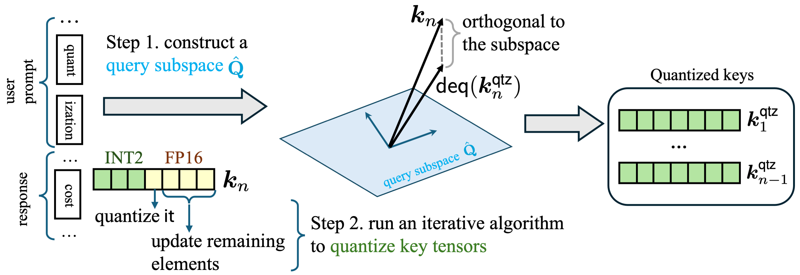

# SQuat: Subspace-orthogonal KV Cache Quantization

Implementation of [paper](https://arxiv.org/abs/2503.24358)


## Overview

We introduce a novel KV cache quantization algorithm: **SQuat** (**S**ubspace-orthogonal KV cache **qua**n**t**ization). SQuat first constructs a subspace that captures the most critical task-related information. During key tensor quantization, it ensures that the difference between the (de)quantized and original keys remains orthogonal to this subspace, thereby minimizing the impact of quantization errors on the attention mechanism's outputs.

SQuat is training-free, requires no calibration data, runs on-the-fly, and is grounded in a theoretical framework we developed. Empirically, it reduces GPU peak memory by 2.17× to 2.82×, improves throughput by 2.45× to 3.60×, and achieves more favorable benchmark scores than existing KV cache quantization algorithms. 

The pipeline of SQuat for quantizing key tensors:
<p align="center">

</p>


## Getting Started

To install requirements:

```bash
conda create -n squat python=3.10
conda activate squat
pip install --upgrade pip  # enable PEP 660 support
pip install -e .
```

Install CUDA implementation:

```bash
cd quant && pip install -e .
```

## Examples

Load model with SQuat-pre: (e.g., Llama-3.1-8B-Instruct)

```python
# LLaMA model with SQuat
import torch
import os
from models.llama_squat import LlamaForCausalLM_SQuat
from transformers import LlamaConfig, AutoTokenizer
config = LlamaConfig.from_pretrained("meta-llama/Llama-3.1-8B-Instruct")

config.k_bits = K_BITS # current support 2/4 bit for KV Cache
config.v_bits = V_BITS # current support 2/4 bit for KV Cache
config.group_size = GROUP_SIZE
config.residual_length = RESIDUAL_LENGTH # the number of recent fp16 tokens
config.use_flash = True
config.method = "squat_pre"
config.subspace_dim = 5
config.squat_lambda = 0.001
config.quant_group_size = 64
CACHE_DIR = PATH_TO_YOUR_SAVE_DIR

model = LlamaForCausalLM_SQuat.from_pretrained(
    pretrained_model_name_or_path='meta-llama/Llama-3.1-8B-Instruct',
    config=config,
    cache_dir=CACHE_DIR,
    torch_dtype=torch.float16,
    low_cpu_mem_usage=True,
    device_map="auto",
)

tokenizer = AutoTokenizer.from_pretrained(
    'meta-llama/Llama-3.1-8B-Instruct', 
    use_fast=False, 
    trust_remote_code=True)

# Inference
# e.g., model.generate(...)
```

### GSM8K example
We use GSM8K as an example to show how to use SQuat. You can check [example.py](./example.py):

```bash
python example.py
```

### Math500 example
This example shows how to test SQuat on Math500. (evaluation needs `latex2sympy2` and `word2number`) You can check [my_test_math500.py](./my_test_math500.py):

```bash
python my_test_math500.py --batch_size 100 --method squat \
  --squat_lambda 0.001 --quant_group_size 64 --subspace_dim 60 --shared_svd true \
  --group_size 32 --residual_length 32 --dataset math500_v2 --index_file idx_rand-100_0.txt 
```

### Evaluation on LongBench
This example shows how to test SQuat on LongBench. Code modified from [KIVI](https://github.com/jy-yuan/KIVI).
```bash
python my_pred_long_bench.py --e 0 \
  --model_name_or_path "meta-llama/Llama-3.1-8B-Instruct" \
  --model_maxlen 8192 --group_size 32 --residual_length 32 \
  --method squat --shared_svd true --squat_lambda 0.001 \
  --subspace_dim 60 --quant_group_size 64
python eval_long_bench.py --model {MODEL} # MODEL is the dir name under pred/ Currently it support Llama family model and Mistral model.
```

## Citation

```bibtex
@article{wang2025squat,
  title={SQuat: Subspace-orthogonal KV Cache Quantization},
  author={Wang, Hao and Han, Ligong and Xu, Kai and Srivastava, Akash},
  journal={arXiv preprint arXiv:2503.24358},
  year={2025}
}
```

## Acknowledgement

Our code and CUDA implementation builds on the [code](https://github.com/jy-yuan/KIVI) released by Liu et al. for their ICML 2024 paper, "Kivi: A Tuning-Free Asymmetric 2-bit Quantization for KV Cache." We thank the authors for generously open-sourcing their work!
